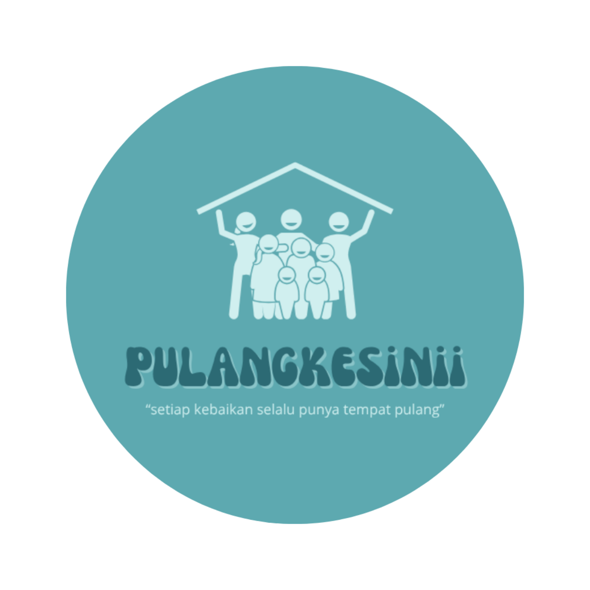

<div align="center">
  

  # Pulangkesinii

  **Setiap Kebaikan Selalu Punya Tempat Pulang**

  Website komunitas untuk menemukan kegiatan volunteer, voluntrip, aktivitas sosial, dan peluang kolaborasi bersama Pulangkesinii.
</div>

## Tentang project

Website ini dirancang sebagai pintu utama bagi calon volunteer: informasi kegiatan ditempatkan di bagian awal, kemudian dilanjutkan dengan cerita komunitas, dokumentasi kegiatan, program, nilai, visi dan misi, FAQ, serta kanal kontak resmi.

Antarmuka menggunakan pendekatan mobile-first dengan struktur katalog kegiatan yang terinspirasi dari alur pencarian kegiatan pada Kitabisa Experience, lalu disesuaikan sepenuhnya dengan identitas visual dan materi Pulangkesinii.

## Fitur utama

- Katalog kegiatan volunteer, voluntrip, dan fun activity.
- Pencarian serta filter kegiatan berdasarkan wilayah.
- Carousel informasi komunitas dan daftar kegiatan horizontal.
- Detail kegiatan dalam modal interaktif.
- Galeri **Momen Kebaikan** berisi dokumentasi kegiatan asli.
- Bagian About, Our Story, program, nilai, visi, misi, dan jangkauan wilayah.
- FAQ accordion, halaman legal sementara, dan navigasi keyboard.
- Kontak langsung melalui WhatsApp dan email.
- Aset brand Pulangkesinii, elemen dekoratif, maskot, dan emoji Apple.
- Tampilan mobile-first yang tetap terpusat dan nyaman dibaca di desktop.

## Tech stack

- [React 19](https://react.dev/) dan TypeScript
- [Vite 6](https://vite.dev/)
- [Tailwind CSS 4](https://tailwindcss.com/)
- [Lucide React](https://lucide.dev/) untuk ikon antarmuka
- `emoji-datasource-apple` untuk sumber emoji bergaya Apple
- CSS responsif khusus untuk layout dan interaction states

## Menjalankan secara lokal

### Prasyarat

- Node.js 18 atau lebih baru
- npm

### Instalasi

```bash
git clone https://github.com/solivatestudio/pulangkesinii.git
cd pulangkesinii
npm install
npm run dev
```

Development server berjalan di [http://localhost:3000](http://localhost:3000).

Project ini tidak memerlukan environment variable untuk menjalankan frontend saat ini.

## Skrip tersedia

| Perintah | Fungsi |
| --- | --- |
| `npm run dev` | Menjalankan development server di port `3000` |
| `npm run lint` | Memeriksa tipe TypeScript tanpa menghasilkan file build |
| `npm run build` | Membuat production build ke folder `dist/` |
| `npm run preview` | Menjalankan preview production build |

## Struktur project

```text
pulangkesinii/
├── public/
│   ├── assets/          # Logo, maskot, dekorasi, dan emoji Apple
│   └── images/web/      # Dokumentasi kegiatan yang dioptimalkan ke WebP
├── src/
│   ├── App.tsx          # Struktur halaman dan interaction state utama
│   ├── index.css        # Design system dan styling responsif
│   └── main.tsx         # Entry point React
├── index.html           # Metadata, favicon, dan root HTML
├── package.json         # Dependency dan npm scripts
└── vite.config.ts       # Konfigurasi Vite
```

## Aset dan konten

- Aset brand berada di `public/assets`.
- Foto yang digunakan website berada di `public/images/web` dalam format WebP agar lebih ringan dan kompatibel dengan browser modern.
- Data judul, tanggal, lokasi, dan biaya kegiatan masih menggunakan state sementara sampai jadwal resmi diberikan oleh tim Pulangkesinii.
- Informasi kegiatan terbaru diarahkan ke WhatsApp resmi Pulangkesinii.

## Kontak Pulangkesinii

- Email: [pulangkesinii@gmail.com](mailto:pulangkesinii@gmail.com)
- Instagram: `@pulangkesinii`
- TikTok: `@Pulangkesinii_`
- LinkedIn: `Pulangkesinii`
- Threads: `@Pulangkesinii`
- WhatsApp: [+62 857-7932-1681](https://wa.me/6285779321681)
- Basecamp: Jakarta Timur

---

<div align="center">
  Dibuat untuk menghadirkan ruang pulang melalui kebaikan.
</div>
